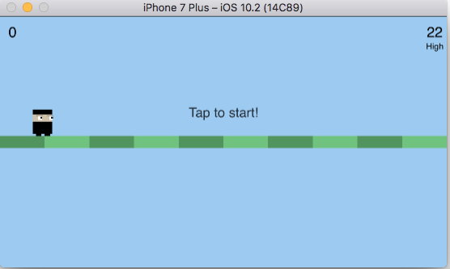
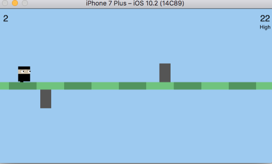
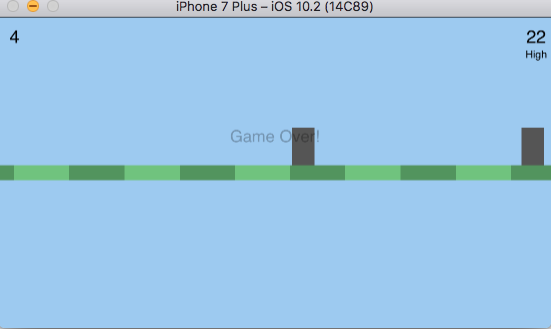

# FlipMan
Swift game made using an online tutorial
The point of the game is to avoid the blocks that come at speed, and the hero must flip to each side of the ground in order to avoid the blocks and ultimately, die.  The player must tap on the screen in order to flip the hero to either side.  

